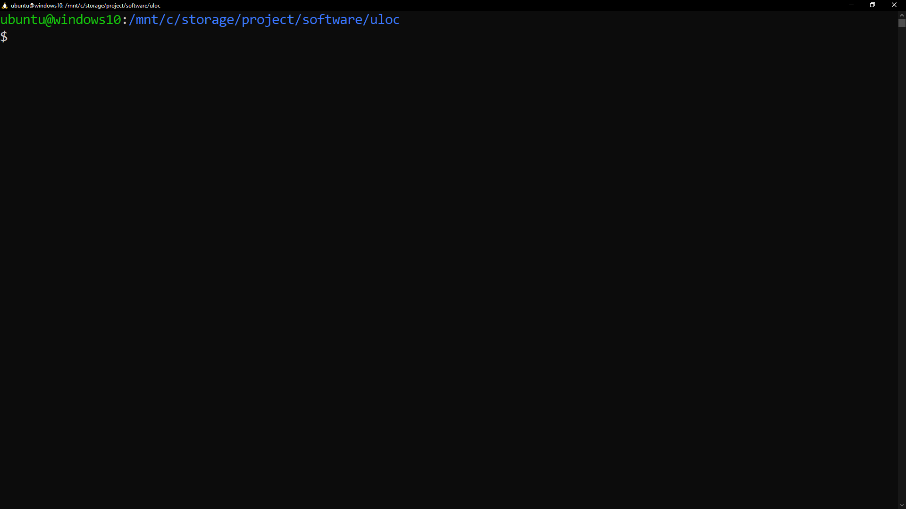

# uloc - Unique Lines of Code

uloc is a simple CLI tool for scaning files and directories, and checking how many lines in each file are unique. This may be used to tell how much repetetive code there is in your source files.

## Building

### Windows

Make sure you have Visual Studio or it's Build Tools installed.

Download the repo and open up a `x64 Native Tools Command Prompt for VS 20XX` (press the Windows key and type "x64", you should see it pop up).

Change the current directory to the folder you downloaded using `cd`. Then type `build.bat` and press enter.

That's it. You should see `uloc.exe` inside the folder (type `dir`).

Type `uloc -help` for some info. Put it somewhere in your System PATH, so that you can use `uloc` inside any directory.

### Linux

Download the repo and open up the folder in a terminal.

Make sure `gcc` and `make` are installed. Run `make build`.

Type `./uloc --help` for some info. Put it somewhere in your PATH (for example in `/usr/bin`), so that you can use `uloc` inside any directory.
